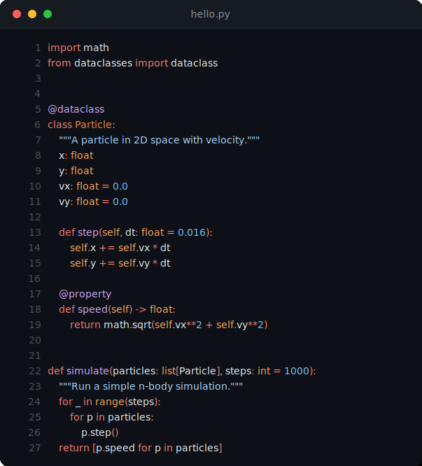
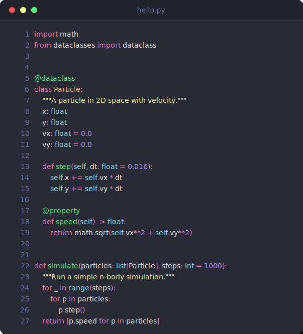
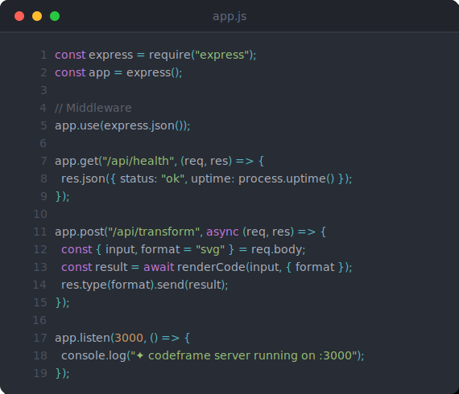
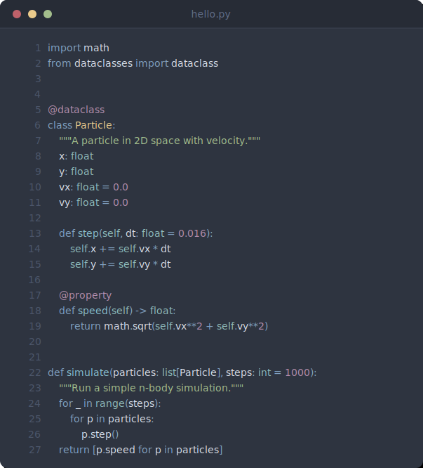
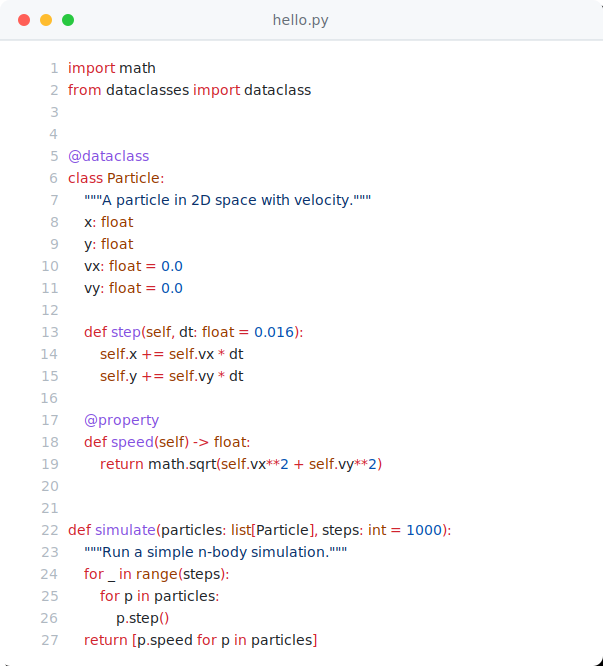

# codeframe

Beautiful code screenshots from your terminal. No browser, no upload, no fuss.

One command → syntax-highlighted SVG with window chrome, traffic lights, and line numbers.

<br>

<div align="center">

</div>

<br>

## Why

You want a code screenshot for your README, blog post, slide deck, or tweet. Current options:

- **Carbon.sh** — opens a browser, pastes code, adjusts settings, downloads PNG. Every. Single. Time.
- **Silicon** — Rust. If you don't have `cargo`, you don't have Silicon.
- **Freeze** — Go. Same story.
- **Screenshots** — manually crop, inconsistent, not scalable.

**codeframe** is a single Python file. `pip install`, run, done. Output is SVG — scalable, tiny, embeddable anywhere.

<br>

## Install

```bash
pip install pygments   # only dependency
```

Then grab `codeframe.py` or clone the repo:

```bash
git clone https://github.com/Jah-yee/codeframe.git
```

<br>

## Usage

```bash
# basic
python codeframe.py hello.py -o hello.svg

# pick a theme
python codeframe.py app.js --theme dracula -o app.svg

# pipe from stdin
cat main.rs | python codeframe.py --lang rust -o main.svg

# hide line numbers
python codeframe.py config.yml --no-lines -o config.svg

# list themes
python codeframe.py --list-themes
```

<br>

## Themes

Five built-in themes. All with dark chrome, traffic lights, and proper syntax colors.

<br>

### GitHub Dark *(default)*


### Dracula



### One Dark



### Nord



### GitHub Light



<br>

## How It Works

1. **Pygments** tokenizes your code (500+ languages supported)
2. Tokens are mapped to theme-specific colors
3. SVG is built with `<text>` and `<tspan>` elements — no rasterization, no browser
4. Window chrome (traffic lights, filename, border) is added
5. Output is a single `.svg` file — scalable to any size

No headless browsers. No Puppeteer. No canvas. Just string concatenation into valid SVG.

<br>

## Output Format

SVG output means:

- **Scalable** — renders crisp at any resolution
- **Tiny** — typically 5–15kb vs 200kb+ PNGs
- **Embeddable** — works in GitHub READMEs, HTML, Markdown, Notion
- **Editable** — it's just XML, tweak colors/fonts in any text editor
- **Dark/light agnostic** — the theme is baked in, no system preference issues

<br>

## Supported Languages

Everything Pygments supports: Python, JavaScript, TypeScript, Rust, Go, C, C++, Java, Ruby, PHP, Swift, Kotlin, Bash, SQL, HTML, CSS, YAML, JSON, Markdown, and [300+ more](https://pygments.org/languages/).

<br>

## Contributing

PRs welcome. Some ideas:

- [ ] More themes (Monokai, Solarized, Catppuccin, Tokyo Night)
- [ ] PNG/PDF output via `cairosvg`
- [ ] `pip install codeframe` with entry point
- [ ] Line highlighting (`--highlight 5-8`)
- [ ] Window title override (`--title "my server"`)
- [ ] Diff mode (red/green highlighting)

<br>

## License

MIT

<br>

<div align="center">
<sub>

One file. One dependency. Beautiful output.

</sub>
</div>
